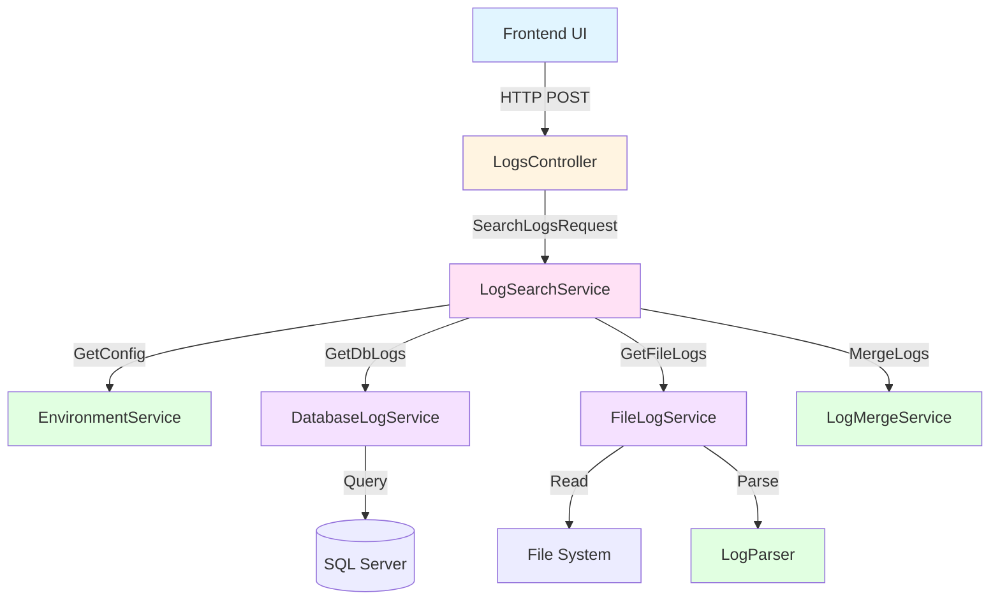
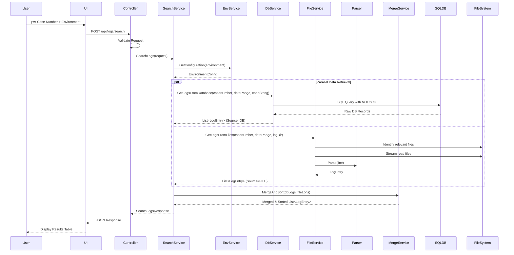

# מסמך עיצוב טכני - Generic Calculation Log Viewer

## סקירה כללית (Overview)

מערכת Generic Calculation Log Viewer היא כלי פנימי לדיבאג ומוניטורינג המאפשר למפתחים ולמהנדסי תמיכה לאתר ולנתח לוגים שנוצרו במהלך ריצות חישוב. המערכת מאחזרת לוגים משני מקורות עצמאיים (מסד נתונים SQL Server וקבצי לוג runtime), ממזגת אותם לציר זמן כרונולוגי מאוחד, ומציגה אותם בממשק אינטואיטיבי.

### מטרות העיצוב

1. **ביצועים**: אחזור מהיר של לוגים (עד 2 שניות לחיפוש טיפוסי)
2. **יעילות זיכרון**: קריאת קבצים גדולים באמצעות streaming ללא טעינה מלאה לזיכרון
3. **חוסן**: המשך פעולה גם במקרה של כשל חלקי במקור אחד
4. **מודולריות**: ארכיטקטורה מבוססת interfaces ו-Dependency Injection
5. **תחזוקה**: קוד נקי, מובנה ובדיק

### טכנולוגיות מרכזיות

- **Backend**: .NET 6+ Web API
- **Database**: SQL Server (גישה באמצעות ADO.NET או Dapper)
- **Frontend**: HTML/JavaScript/CSS (או React/Vue לפי בחירה)
- **Dependency Injection**: Microsoft.Extensions.DependencyInjection
- **Logging**: Microsoft.Extensions.Logging

## ארכיטקטורה (Architecture)

### ארכיטקטורה ברמה גבוהה

המערכת בנויה בארכיטקטורת שכבות (Layered Architecture) עם הפרדה ברורה בין רכיבים:

```
┌─────────────────────────────────────────────────────────┐
│                    Frontend (UI)                        │
│              HTML/JS - Search Form & Results            │
└────────────────────┬────────────────────────────────────┘
                     │ HTTP/JSON
┌────────────────────▼────────────────────────────────────┐
│                  API Layer                              │
│              LogsController (Web API)                   │
└────────────────────┬────────────────────────────────────┘
                     │
┌────────────────────▼────────────────────────────────────┐
│              Service Orchestration                      │
│              LogSearchService                           │
└──────┬──────────────────────────────────────┬───────────┘
       │                                      │
┌──────▼──────────────┐            ┌─────────▼────────────┐
│  Data Access Layer  │            │  File Access Layer   │
│ DatabaseLogService  │            │   FileLogService     │
└──────┬──────────────┘            └─────────┬────────────┘
       │                                      │
┌──────▼──────────────┐            ┌─────────▼────────────┐
│   SQL Server DB     │            │   File System        │
│  gvia.srv_Generic   │            │   \\server\logs\     │
│   Calc_log          │            │                      │
└─────────────────────┘            └──────────────────────┘

       ┌──────────────────────────────────────┐
       │      Cross-Cutting Services          │
       │  - EnvironmentService                │
       │  - LogParser                         │
       │  - LogMergeService                   │
       └──────────────────────────────────────┘
```

### תרשים רכיבים (Component Diagram)



### תרשים רצף - חיפוש לוגים (Sequence Diagram)



## רכיבים וממשקים (Components and Interfaces)

### 1. LogsController

**אחריות**: נקודת כניסה ל-API, אימות בקשות, טיפול בשגיאות HTTP

**Endpoint**:
- `POST /api/logs/search`

**Dependencies**:
- `ILogSearchService`
- `ILogger<LogsController>`

**Methods**:

```csharp
[ApiController]
[Route("api/logs")]
public class LogsController : ControllerBase
{
    private readonly ILogSearchService _searchService;
    private readonly ILogger<LogsController> _logger;

    public LogsController(ILogSearchService searchService, ILogger<LogsController> logger)
    {
        _searchService = searchService;
        _logger = logger;
    }

    [HttpPost("search")]
    public async Task<ActionResult<SearchLogsResponse>> Search([FromBody] SearchLogsRequest request)
    {
        // Validation
        if (!ValidateRequest(request, out var validationError))
        {
            return BadRequest(new { error = validationError });
        }

        try
        {
            var response = await _searchService.SearchLogsAsync(request);
            return Ok(response);
        }
        catch (Exception ex)
        {
            _logger.LogError(ex, "Error searching logs for case {CaseNumber} in {Environment}", 
                request.CaseNumber, request.Environment);
            return StatusCode(500, new { error = "Internal server error occurred while searching logs" });
        }
    }

    private bool ValidateRequest(SearchLogsRequest request, out string error)
    {
        error = null;

        if (request.CaseNumber <= 0)
        {
            error = "CaseNumber must be greater than zero";
            return false;
        }

        var validEnvironments = new[] { "DEV", "TEST", "INT", "PROD" };
        if (!validEnvironments.Contains(request.Environment?.ToUpper()))
        {
            error = "Environment must be one of: DEV, TEST, INT, PROD";
            return false;
        }

        if (request.FromDate.HasValue && request.ToDate.HasValue && 
            request.FromDate.Value >= request.ToDate.Value)
        {
            error = "FromDate must be earlier than ToDate";
            return false;
        }

        return true;
    }
}
```

### 2. ILogSearchService / LogSearchService

**אחריות**: תיאום תהליך החיפוש המלא, קריאה למקורות מרובים, טיפול בכשלים חלקיים

**Interface**:

```csharp
public interface ILogSearchService
{
    Task<SearchLogsResponse> SearchLogsAsync(SearchLogsRequest request);
}
```

**Implementation**:

```csharp
public class LogSearchService : ILogSearchService
{
    private readonly IEnvironmentService _environmentService;
    private readonly IDatabaseLogService _databaseLogService;
    private readonly IFileLogService _fileLogService;
    private readonly ILogMergeService _mergeService;
    private readonly ILogger<LogSearchService> _logger;

    public LogSearchService(
        IEnvironmentService environmentService,
        IDatabaseLogService databaseLogService,
        IFileLogService fileLogService,
        ILogMergeService mergeService,
        ILogger<LogSearchService> logger)
    {
        _environmentService = environmentService;
        _databaseLogService = databaseLogService;
        _fileLogService = fileLogService;
        _mergeService = mergeService;
        _logger = logger;
    }

    public async Task<SearchLogsResponse> SearchLogsAsync(SearchLogsRequest request)
    {
        // Get environment configuration
        var config = _environmentService.GetConfiguration(request.Environment);

        // Set default date range if not provided
        var fromDate = request.FromDate ?? DateTime.Now.AddHours(-24);
        var toDate = request.ToDate ?? DateTime.Now;

        var dbLogs = new List<LogEntry>();
        var fileLogs = new List<LogEntry>();

        // Retrieve logs from database (with error handling)
        try
        {
            dbLogs = await _databaseLogService.GetLogsAsync(
                request.CaseNumber, 
                fromDate, 
                toDate, 
                config.ConnectionString);
        }
        catch (Exception ex)
        {
            _logger.LogError(ex, "Failed to retrieve logs from database for case {CaseNumber}", 
                request.CaseNumber);
            // Continue with file logs
        }

        // Retrieve logs from files (with error handling)
        try
        {
            fileLogs = await _fileLogService.GetLogsAsync(
                request.CaseNumber, 
                fromDate, 
                toDate, 
                config.LogDirectory);
        }
        catch (Exception ex)
        {
            _logger.LogError(ex, "Failed to retrieve logs from files for case {CaseNumber}", 
                request.CaseNumber);
            // Continue with db logs
        }

        // Merge and sort logs
        var mergedLogs = _mergeService.MergeAndSort(dbLogs, fileLogs);

        return new SearchLogsResponse
        {
            Logs = mergedLogs
        };
    }
}
```


### 3. IEnvironmentService / EnvironmentService

**אחריות**: ניהול תצורות סביבה, מתן גישה למחרוזות חיבור ונתיבי קבצים

**Interface**:

```csharp
public interface IEnvironmentService
{
    EnvironmentConfiguration GetConfiguration(string environment);
}
```

**Implementation**:

```csharp
public class EnvironmentService : IEnvironmentService
{
    private readonly Dictionary<string, EnvironmentConfiguration> _configurations;
    private readonly ILogger<EnvironmentService> _logger;

    public EnvironmentService(IConfiguration configuration, ILogger<EnvironmentService> logger)
    {
        _logger = logger;
        _configurations = new Dictionary<string, EnvironmentConfiguration>(StringComparer.OrdinalIgnoreCase)
        {
            ["DEV"] = new EnvironmentConfiguration
            {
                Environment = "DEV",
                ConnectionString = configuration.GetConnectionString("Gvia_DEV"),
                LogDirectory = configuration["LogDirectories:DEV"]
            },
            ["TEST"] = new EnvironmentConfiguration
            {
                Environment = "TEST",
                ConnectionString = configuration.GetConnectionString("Gvia_TEST"),
                LogDirectory = configuration["LogDirectories:TEST"]
            },
            ["INT"] = new EnvironmentConfiguration
            {
                Environment = "INT",
                ConnectionString = configuration.GetConnectionString("Gvia_INT"),
                LogDirectory = configuration["LogDirectories:INT"]
            },
            ["PROD"] = new EnvironmentConfiguration
            {
                Environment = "PROD",
                ConnectionString = configuration.GetConnectionString("Gvia_PROD"),
                LogDirectory = configuration["LogDirectories:PROD"]
            }
        };
    }

    public EnvironmentConfiguration GetConfiguration(string environment)
    {
        if (string.IsNullOrWhiteSpace(environment))
        {
            throw new ArgumentException("Environment cannot be null or empty", nameof(environment));
        }

        if (!_configurations.TryGetValue(environment, out var config))
        {
            throw new ArgumentException($"Unsupported environment: {environment}. " +
                $"Supported environments are: {string.Join(", ", _configurations.Keys)}");
        }

        return config;
    }
}
```

### 4. IDatabaseLogService / DatabaseLogService

**אחריות**: אחזור לוגים ממסד נתונים SQL Server

**Interface**:

```csharp
public interface IDatabaseLogService
{
    Task<List<LogEntry>> GetLogsAsync(int caseNumber, DateTime fromDate, DateTime toDate, string connectionString);
}
```

**Implementation**:

```csharp
public class DatabaseLogService : IDatabaseLogService
{
    private readonly ILogger<DatabaseLogService> _logger;
    private const int MaxRecords = 10000;

    public DatabaseLogService(ILogger<DatabaseLogService> logger)
    {
        _logger = logger;
    }

    public async Task<List<LogEntry>> GetLogsAsync(
        int caseNumber, 
        DateTime fromDate, 
        DateTime toDate, 
        string connectionString)
    {
        var logs = new List<LogEntry>();

        var query = @"
            SELECT TOP (@MaxRecords)
                ms_merkaz_req,
                op_time,
                log_level,
                message
            FROM gvia.srv_GenericCalc_log WITH (NOLOCK)
            WHERE ms_merkaz_req = @CaseNumber
                AND op_time >= @FromDate
                AND op_time <= @ToDate
            ORDER BY op_time ASC";

        try
        {
            using var connection = new SqlConnection(connectionString);
            await connection.OpenAsync();

            using var command = new SqlCommand(query, connection);
            command.Parameters.AddWithValue("@MaxRecords", MaxRecords);
            command.Parameters.AddWithValue("@CaseNumber", caseNumber);
            command.Parameters.AddWithValue("@FromDate", fromDate);
            command.Parameters.AddWithValue("@ToDate", toDate);

            using var reader = await command.ExecuteReaderAsync();
            while (await reader.ReadAsync())
            {
                logs.Add(new LogEntry
                {
                    Timestamp = reader.GetDateTime(reader.GetOrdinal("op_time")),
                    Source = "DB",
                    Level = reader.GetString(reader.GetOrdinal("log_level")),
                    Message = reader.GetString(reader.GetOrdinal("message")),
                    CaseNumber = reader.GetInt32(reader.GetOrdinal("ms_merkaz_req")).ToString()
                });
            }

            _logger.LogInformation("Retrieved {Count} logs from database for case {CaseNumber}", 
                logs.Count, caseNumber);
        }
        catch (SqlException ex)
        {
            _logger.LogError(ex, "Database error while retrieving logs for case {CaseNumber}", caseNumber);
            throw new InvalidOperationException($"Failed to retrieve logs from database: {ex.Message}", ex);
        }

        return logs;
    }
}
```

### 5. IFileLogService / FileLogService

**אחריות**: אחזור לוגים מקבצי runtime באמצעות streaming

**Interface**:

```csharp
public interface IFileLogService
{
    Task<List<LogEntry>> GetLogsAsync(int caseNumber, DateTime fromDate, DateTime toDate, string logDirectory);
}
```

**Implementation**:

```csharp
public class FileLogService : IFileLogService
{
    private readonly ILogParser _parser;
    private readonly ILogger<FileLogService> _logger;

    public FileLogService(ILogParser parser, ILogger<FileLogService> logger)
    {
        _parser = parser;
        _logger = logger;
    }

    public async Task<List<LogEntry>> GetLogsAsync(
        int caseNumber, 
        DateTime fromDate, 
        DateTime toDate, 
        string logDirectory)
    {
        var logs = new List<LogEntry>();

        if (!Directory.Exists(logDirectory))
        {
            throw new DirectoryNotFoundException($"Log directory not found: {logDirectory}");
        }

        // Identify relevant log files based on date range
        var relevantFiles = GetRelevantLogFiles(logDirectory, fromDate, toDate);

        _logger.LogInformation("Found {Count} relevant log files for case {CaseNumber}", 
            relevantFiles.Count, caseNumber);

        foreach (var filePath in relevantFiles)
        {
            try
            {
                var fileLogs = await ReadLogsFromFileAsync(filePath, caseNumber);
                logs.AddRange(fileLogs);
            }
            catch (Exception ex)
            {
                _logger.LogError(ex, "Failed to read log file: {FilePath}", filePath);
                // Continue with next file
            }
        }

        // Filter by date range
        logs = logs.Where(log => log.Timestamp >= fromDate && log.Timestamp <= toDate).ToList();

        _logger.LogInformation("Retrieved {Count} logs from files for case {CaseNumber}", 
            logs.Count, caseNumber);

        return logs;
    }

    private List<string> GetRelevantLogFiles(string logDirectory, DateTime fromDate, DateTime toDate)
    {
        var allFiles = Directory.GetFiles(logDirectory, "*.log", SearchOption.TopDirectoryOnly);
        
        // Assuming log files are named with date pattern: calc_YYYYMMDD.log
        var relevantFiles = allFiles
            .Where(file =>
            {
                var fileName = Path.GetFileNameWithoutExtension(file);
                if (fileName.Length >= 8)
                {
                    var datePart = fileName.Substring(fileName.Length - 8);
                    if (DateTime.TryParseExact(datePart, "yyyyMMdd", null, 
                        System.Globalization.DateTimeStyles.None, out var fileDate))
                    {
                        return fileDate.Date >= fromDate.Date && fileDate.Date <= toDate.Date;
                    }
                }
                return true; // Include files without date pattern
            })
            .OrderBy(f => f)
            .ToList();

        return relevantFiles;
    }

    private async Task<List<LogEntry>> ReadLogsFromFileAsync(string filePath, int caseNumber)
    {
        var logs = new List<LogEntry>();
        var caseNumberStr = caseNumber.ToString();

        // Streaming read - line by line
        using var fileStream = new FileStream(filePath, FileMode.Open, FileAccess.Read, FileShare.ReadWrite);
        using var reader = new StreamReader(fileStream);

        string line;
        while ((line = await reader.ReadLineAsync()) != null)
        {
            // Filter lines containing case number
            if (line.Contains(caseNumberStr))
            {
                try
                {
                    var logEntry = _parser.Parse(line, caseNumberStr);
                    if (logEntry != null)
                    {
                        logEntry.Source = "FILE";
                        logs.Add(logEntry);
                    }
                }
                catch (Exception ex)
                {
                    _logger.LogWarning(ex, "Failed to parse log line: {Line}", line);
                    // Continue with next line
                }
            }
        }

        return logs;
    }
}
```


### 6. ILogParser / LogParser

**אחריות**: פרסור שורות לוג גולמיות לאובייקטים מובנים

**Interface**:

```csharp
public interface ILogParser
{
    LogEntry Parse(string logLine, string caseNumber);
    string Format(LogEntry logEntry);
}
```

**Implementation**:

```csharp
public class LogParser : ILogParser
{
    private readonly ILogger<LogParser> _logger;
    
    // Regex pattern: YYYY-MM-DD HH:MM:SS LEVEL Message
    private static readonly Regex LogPattern = new Regex(
        @"^(\d{4}-\d{2}-\d{2}\s+\d{2}:\d{2}:\d{2})\s+(\w+)\s+(.+)$",
        RegexOptions.Compiled);

    public LogParser(ILogger<LogParser> logger)
    {
        _logger = logger;
    }

    public LogEntry Parse(string logLine, string caseNumber)
    {
        if (string.IsNullOrWhiteSpace(logLine))
        {
            return null;
        }

        var match = LogPattern.Match(logLine);
        if (!match.Success)
        {
            _logger.LogWarning("Log line does not match expected format: {Line}", logLine);
            return null;
        }

        try
        {
            var timestamp = DateTime.Parse(match.Groups[1].Value);
            var level = match.Groups[2].Value;
            var message = match.Groups[3].Value;

            return new LogEntry
            {
                Timestamp = timestamp,
                Level = level,
                Message = message,
                CaseNumber = caseNumber,
                Source = null // Will be set by caller
            };
        }
        catch (Exception ex)
        {
            _logger.LogWarning(ex, "Failed to parse log line: {Line}", logLine);
            return null;
        }
    }

    public string Format(LogEntry logEntry)
    {
        if (logEntry == null)
        {
            throw new ArgumentNullException(nameof(logEntry));
        }

        return $"{logEntry.Timestamp:yyyy-MM-dd HH:mm:ss} {logEntry.Level} {logEntry.Message}";
    }
}
```

### 7. ILogMergeService / LogMergeService

**אחריות**: מיזוג ומיון לוגים ממקורות שונים

**Interface**:

```csharp
public interface ILogMergeService
{
    List<LogEntry> MergeAndSort(List<LogEntry> dbLogs, List<LogEntry> fileLogs);
}
```

**Implementation**:

```csharp
public class LogMergeService : ILogMergeService
{
    private readonly ILogger<LogMergeService> _logger;

    public LogMergeService(ILogger<LogMergeService> logger)
    {
        _logger = logger;
    }

    public List<LogEntry> MergeAndSort(List<LogEntry> dbLogs, List<LogEntry> fileLogs)
    {
        var allLogs = new List<LogEntry>();
        
        if (dbLogs != null)
        {
            allLogs.AddRange(dbLogs);
        }
        
        if (fileLogs != null)
        {
            allLogs.AddRange(fileLogs);
        }

        // Sort by Timestamp ascending, then by Source (FILE before DB for same timestamp)
        var sortedLogs = allLogs
            .OrderBy(log => log.Timestamp)
            .ThenBy(log => log.Source == "FILE" ? 0 : 1)
            .ToList();

        _logger.LogInformation("Merged and sorted {TotalCount} logs ({DbCount} from DB, {FileCount} from files)",
            sortedLogs.Count, dbLogs?.Count ?? 0, fileLogs?.Count ?? 0);

        return sortedLogs;
    }
}
```

## מודלי נתונים (Data Models)

### LogEntry

```csharp
public class LogEntry
{
    /// <summary>
    /// זמן יצירת הלוג
    /// </summary>
    public DateTime Timestamp { get; set; }

    /// <summary>
    /// מקור הלוג: "DB" או "FILE"
    /// </summary>
    public string Source { get; set; }

    /// <summary>
    /// רמת הלוג: INFO, WARN, ERROR, DEBUG
    /// </summary>
    public string Level { get; set; }

    /// <summary>
    /// תוכן הודעת הלוג
    /// </summary>
    public string Message { get; set; }

    /// <summary>
    /// מספר התיק המזהה את ריצת החישוב
    /// </summary>
    public string CaseNumber { get; set; }
}
```

### SearchLogsRequest

```csharp
public class SearchLogsRequest
{
    /// <summary>
    /// סביבת ההרצה: DEV, TEST, INT, PROD
    /// </summary>
    [Required]
    public string Environment { get; set; }

    /// <summary>
    /// מספר התיק לחיפוש
    /// </summary>
    [Required]
    [Range(1, int.MaxValue, ErrorMessage = "CaseNumber must be greater than zero")]
    public int CaseNumber { get; set; }

    /// <summary>
    /// תאריך התחלה (אופציונלי, ברירת מחדל: 24 שעות אחורה)
    /// </summary>
    public DateTime? FromDate { get; set; }

    /// <summary>
    /// תאריך סיום (אופציונלי, ברירת מחדל: זמן נוכחי)
    /// </summary>
    public DateTime? ToDate { get; set; }
}
```

### SearchLogsResponse

```csharp
public class SearchLogsResponse
{
    /// <summary>
    /// רשימת הלוגים שנמצאו
    /// </summary>
    public List<LogEntry> Logs { get; set; } = new List<LogEntry>();

    /// <summary>
    /// מספר הלוגים הכולל
    /// </summary>
    public int TotalCount => Logs?.Count ?? 0;
}
```

### EnvironmentConfiguration

```csharp
public class EnvironmentConfiguration
{
    /// <summary>
    /// שם הסביבה
    /// </summary>
    public string Environment { get; set; }

    /// <summary>
    /// מחרוזת חיבור למסד הנתונים
    /// </summary>
    public string ConnectionString { get; set; }

    /// <summary>
    /// נתיב תיקיית קבצי הלוג
    /// </summary>
    public string LogDirectory { get; set; }
}
```

## עיצוב API

### Endpoint: חיפוש לוגים

**URL**: `POST /api/logs/search`

**Request Headers**:
```
Content-Type: application/json
Authorization: Bearer {token} (אם נדרש)
```

**Request Body**:
```json
{
  "environment": "DEV",
  "caseNumber": 19193496,
  "fromDate": "2026-03-09T00:00:00",
  "toDate": "2026-03-09T23:59:59"
}
```

**Response - Success (200 OK)**:
```json
{
  "logs": [
    {
      "timestamp": "2026-03-09T10:01:03",
      "source": "FILE",
      "level": "INFO",
      "message": "Calculation started for case 19193496",
      "caseNumber": "19193496"
    },
    {
      "timestamp": "2026-03-09T10:01:05",
      "source": "DB",
      "level": "INFO",
      "message": "Processing step 1",
      "caseNumber": "19193496"
    }
  ],
  "totalCount": 2
}
```

**Response - Validation Error (400 Bad Request)**:
```json
{
  "error": "CaseNumber must be greater than zero"
}
```

**Response - Server Error (500 Internal Server Error)**:
```json
{
  "error": "Internal server error occurred while searching logs"
}
```

## עיצוב מסד נתונים

### טבלה: gvia.srv_GenericCalc_log

**מבנה הטבלה** (קיים):
```sql
CREATE TABLE gvia.srv_GenericCalc_log (
    id INT IDENTITY(1,1) PRIMARY KEY,
    ms_merkaz_req INT NOT NULL,
    op_time DATETIME NOT NULL,
    log_level VARCHAR(10) NOT NULL,
    message NVARCHAR(MAX) NOT NULL,
    -- שדות נוספים...
)
```

### אינדקס מומלץ

```sql
CREATE NONCLUSTERED INDEX IX_GenericCalc_log_CaseNumber_Time
ON gvia.srv_GenericCalc_log (ms_merkaz_req, op_time)
INCLUDE (log_level, message)
WITH (ONLINE = ON, FILLFACTOR = 90);
```

**הסבר**:
- **ms_merkaz_req**: עמודת החיפוש העיקרית (Case Number)
- **op_time**: עמודת הסינון והמיון השנייה
- **INCLUDE**: שדות נוספים לכיסוי מלא של השאילתה (covering index)
- **FILLFACTOR = 90**: השארת 10% מקום לצמיחה עתידית

### שאילתה מותאמת

```sql
SELECT TOP (10000)
    ms_merkaz_req,
    op_time,
    log_level,
    message
FROM gvia.srv_GenericCalc_log WITH (NOLOCK)
WHERE ms_merkaz_req = @CaseNumber
    AND op_time >= @FromDate
    AND op_time <= @ToDate
ORDER BY op_time ASC;
```

**אופטימיזציות**:
- **NOLOCK**: מניעת נעילות קריאה (מתאים לכלי דיבאג)
- **TOP (10000)**: הגבלת תוצאות למניעת עומס
- **Parameterized Query**: מניעת SQL Injection ושימוש ב-query plan cache


## עיצוב קריאת קבצים (File Streaming)

### אסטרטגיית Streaming

המערכת משתמשת בקריאת streaming כדי לטפל ביעילות בקבצי לוג גדולים:

```csharp
// Bad approach - loads entire file to memory
var allLines = File.ReadAllLines(filePath); // ❌ לא יעיל

// Good approach - streams line by line
using var fileStream = new FileStream(filePath, FileMode.Open, FileAccess.Read, FileShare.ReadWrite);
using var reader = new StreamReader(fileStream);

string line;
while ((line = await reader.ReadLineAsync()) != null) // ✅ יעיל
{
    // Process line
}
```

### זיהוי קבצים רלוונטיים

**אלגוריתם**:
1. קבל את טווח התאריכים המבוקש
2. סרוק את תיקיית הלוגים
3. זהה קבצים לפי שם (דוגמה: `calc_20260309.log`)
4. סנן קבצים שהתאריך שלהם בטווח המבוקש
5. החזר רשימה ממוינת של נתיבי קבצים

**דוגמה**:
```
Log Directory: \\dev-server\logs\calc\
Files:
  - calc_20260307.log
  - calc_20260308.log
  - calc_20260309.log ← Relevant
  - calc_20260310.log ← Relevant
  - calc_20260311.log

Date Range: 2026-03-09 to 2026-03-10
Result: [calc_20260309.log, calc_20260310.log]
```

### טיפול בקבצים נעולים

```csharp
// FileShare.ReadWrite allows reading files that are currently being written to
using var fileStream = new FileStream(
    filePath, 
    FileMode.Open, 
    FileAccess.Read, 
    FileShare.ReadWrite); // ← Important for active log files
```

## אלגוריתמים מרכזיים

### 1. אלגוריתם פרסור לוג

**Input**: שורת לוג גולמית (string)  
**Output**: אובייקט LogEntry או null

**צעדים**:
1. בדוק אם השורה ריקה → החזר null
2. התאם את השורה לביטוי רגולרי: `^(\d{4}-\d{2}-\d{2}\s+\d{2}:\d{2}:\d{2})\s+(\w+)\s+(.+)$`
3. אם אין התאמה → רשום אזהרה והחזר null
4. חלץ קבוצות: timestamp, level, message
5. המר timestamp למבנה DateTime
6. צור אובייקט LogEntry עם הערכים
7. החזר את האובייקט

**Complexity**: O(n) כאשר n הוא אורך השורה

### 2. אלגוריתם מיזוג ומיון

**Input**: שתי רשימות של LogEntry (dbLogs, fileLogs)  
**Output**: רשימה מאוחדת וממוינת

**צעדים**:
1. צור רשימה חדשה ריקה
2. הוסף את כל הלוגים מ-dbLogs
3. הוסף את כל הלוגים מ-fileLogs
4. מיין לפי:
   - Primary: Timestamp (עולה)
   - Secondary: Source (FILE לפני DB)
5. החזר את הרשימה הממוינת

**Complexity**: O(n log n) כאשר n הוא סך כל הלוגים

**דוגמה**:
```
DB Logs:
  [10:01:05, DB, INFO, "Step 1"]
  [10:01:10, DB, INFO, "Step 2"]

File Logs:
  [10:01:03, FILE, INFO, "Started"]
  [10:01:10, FILE, INFO, "Processing"]

Merged & Sorted:
  [10:01:03, FILE, INFO, "Started"]
  [10:01:05, DB, INFO, "Step 1"]
  [10:01:10, FILE, INFO, "Processing"]  ← FILE before DB
  [10:01:10, DB, INFO, "Step 2"]
```

### 3. אלגוריתם זיהוי ריצות חישוב (Calculation Run Detection)

**Input**: רשימה ממוינת של LogEntry  
**Output**: רשימה של CalculationRun

**צעדים**:
1. אתחל רשימה ריקה של runs
2. אתחל currentRun = null
3. עבור על כל לוג:
   - אם Message מכיל "Calculation started":
     - אם currentRun לא null → סגור אותו והוסף לרשימה
     - צור currentRun חדש עם StartLog
   - אם Message מכיל "Calculation finished":
     - אם currentRun לא null → הגדר EndLog וסגור
   - אחרת:
     - אם currentRun לא null → הוסף ללוגים של currentRun
     - אם currentRun הוא null ופער זמן > 2 דקות מהלוג הקודם:
       - צור run חדש
4. אם currentRun לא null בסוף → הוסף לרשימה
5. החזר את רשימת ה-runs

**Complexity**: O(n) כאשר n הוא מספר הלוגים

## Dependency Injection Configuration

### רישום שירותים ב-Program.cs

```csharp
var builder = WebApplication.CreateBuilder(args);

// Add services to the container
builder.Services.AddControllers();

// Register application services
builder.Services.AddSingleton<IEnvironmentService, EnvironmentService>();
builder.Services.AddSingleton<ILogParser, LogParser>();
builder.Services.AddSingleton<ILogMergeService, LogMergeService>();

builder.Services.AddScoped<IDatabaseLogService, DatabaseLogService>();
builder.Services.AddScoped<IFileLogService, FileLogService>();
builder.Services.AddScoped<ILogSearchService, LogSearchService>();

// Add logging
builder.Services.AddLogging(logging =>
{
    logging.AddConsole();
    logging.AddDebug();
    logging.SetMinimumLevel(LogLevel.Information);
});

// Add CORS if needed
builder.Services.AddCors(options =>
{
    options.AddPolicy("AllowInternalNetwork", policy =>
    {
        policy.WithOrigins("http://internal-app.company.com")
              .AllowAnyMethod()
              .AllowAnyHeader();
    });
});

var app = builder.Build();

// Configure the HTTP request pipeline
if (app.Environment.IsDevelopment())
{
    app.UseDeveloperExceptionPage();
}

app.UseHttpsRedirection();
app.UseCors("AllowInternalNetwork");
app.UseAuthorization();
app.MapControllers();

app.Run();
```

### הסבר Service Lifetimes

| Service | Lifetime | הסבר |
|---------|----------|------|
| EnvironmentService | Singleton | תצורה סטטית, נטענת פעם אחת |
| LogParser | Singleton | ללא state, ניתן לשימוש חוזר |
| LogMergeService | Singleton | ללא state, ניתן לשימוש חוזר |
| DatabaseLogService | Scoped | חיבור DB לכל request |
| FileLogService | Scoped | קריאת קבצים לכל request |
| LogSearchService | Scoped | מתאם פעולה לכל request |

### קובץ תצורה - appsettings.json

```json
{
  "ConnectionStrings": {
    "Gvia_DEV": "Server=dev-sql-server;Database=Gvia_DEV;Integrated Security=true;TrustServerCertificate=true",
    "Gvia_TEST": "Server=test-sql-server;Database=Gvia_TEST;Integrated Security=true;TrustServerCertificate=true",
    "Gvia_INT": "Server=int-sql-server;Database=Gvia_INT;Integrated Security=true;TrustServerCertificate=true",
    "Gvia_PROD": "Server=prod-sql-server;Database=Gvia_PROD;Integrated Security=true;TrustServerCertificate=true"
  },
  "LogDirectories": {
    "DEV": "\\\\dev-server\\logs\\calc",
    "TEST": "\\\\test-server\\logs\\calc",
    "INT": "\\\\int-server\\logs\\calc",
    "PROD": "\\\\prod-server\\logs\\calc"
  },
  "Logging": {
    "LogLevel": {
      "Default": "Information",
      "Microsoft.AspNetCore": "Warning"
    }
  },
  "AllowedHosts": "*"
}
```

## טיפול בשגיאות (Error Handling)

### אסטרטגיית טיפול בשגיאות

המערכת משתמשה באסטרטגיה של **Graceful Degradation** - המשך פעולה גם במקרה של כשל חלקי.

### סוגי שגיאות וטיפול

#### 1. שגיאות אימות (Validation Errors)

**מקור**: נתוני קלט לא תקינים  
**טיפול**: החזרת HTTP 400 עם הודעה תיאורית  
**דוגמה**:
```csharp
if (request.CaseNumber <= 0)
{
    return BadRequest(new { error = "CaseNumber must be greater than zero" });
}
```

#### 2. שגיאות חיבור למסד נתונים

**מקור**: כשל בחיבור או שאילתה  
**טיפול**: 
- רישום השגיאה ב-log
- המשך עם מקור הקבצים בלבד
- אם שני המקורות נכשלו → HTTP 500

```csharp
try
{
    dbLogs = await _databaseLogService.GetLogsAsync(...);
}
catch (Exception ex)
{
    _logger.LogError(ex, "Failed to retrieve logs from database");
    // Continue with file logs
}
```

#### 3. שגיאות קריאת קבצים

**מקור**: תיקייה לא נגישה, קובץ נעול, שגיאת קריאה  
**טיפול**:
- רישום השגיאה ב-log
- דילוג על הקובץ הבעייתי
- המשך עם קבצים אחרים

```csharp
foreach (var filePath in relevantFiles)
{
    try
    {
        var fileLogs = await ReadLogsFromFileAsync(filePath, caseNumber);
        logs.AddRange(fileLogs);
    }
    catch (Exception ex)
    {
        _logger.LogError(ex, "Failed to read log file: {FilePath}", filePath);
        // Continue with next file
    }
}
```

#### 4. שגיאות פרסור

**מקור**: פורמט לוג לא תקין  
**טיפול**:
- רישום אזהרה ב-log
- דילוג על השורה
- המשך עם שורות אחרות

```csharp
try
{
    var logEntry = _parser.Parse(line, caseNumberStr);
    if (logEntry != null)
    {
        logs.Add(logEntry);
    }
}
catch (Exception ex)
{
    _logger.LogWarning(ex, "Failed to parse log line: {Line}", line);
    // Continue with next line
}
```

### מבנה הודעות שגיאה למשתמש

```json
{
  "error": "Failed to retrieve logs from database",
  "details": "Connection timeout occurred",
  "suggestion": "Please verify the environment is accessible and try again"
}
```


## שיקולי ביצועים (Performance Considerations)

### 1. אופטימיזציית שאילתות מסד נתונים

- **אינדקס**: שימוש באינדקס על (ms_merkaz_req, op_time) מפחית זמן שאילתה מ-O(n) ל-O(log n)
- **NOLOCK**: מניעת נעילות קריאה משפרת concurrency
- **TOP (10000)**: הגבלת תוצאות מונעת עומס יתר
- **Covering Index**: הכללת שדות נוספים ב-INCLUDE מונעת lookup נוסף

### 2. יעילות זיכרון

- **Streaming**: קריאת קבצים שורה אחר שורה חוסכת זיכרון
- **Early Filtering**: סינון לפי case number בזמן קריאה מפחית נתונים בזיכרון
- **Lazy Evaluation**: עיבוד נתונים רק כשנדרש

### 3. אופטימיזציית I/O

- **FileShare.ReadWrite**: מאפשר קריאה מקבצים פעילים ללא נעילה
- **Parallel Retrieval**: אחזור מ-DB ו-Files במקביל (אם נדרש)
- **File Selection**: זיהוי קבצים רלוונטיים לפני קריאה מפחית I/O מיותר

### 4. מדדי ביצועים צפויים

| פעולה | זמן צפוי | הערות |
|-------|----------|-------|
| שאילתת DB (עם אינדקס) | < 500ms | עד 10,000 רשומות |
| קריאת קובץ לוג (10MB) | < 1s | עם streaming |
| מיזוג ומיון (10,000 רשומות) | < 100ms | O(n log n) |
| חיפוש כולל | < 2s | DB + Files + Merge |

## שיקולי אבטחה (Security Considerations)

### 1. הגנה מפני SQL Injection

```csharp
// ✅ Good - Parameterized query
command.Parameters.AddWithValue("@CaseNumber", caseNumber);

// ❌ Bad - String concatenation
var query = $"SELECT * FROM logs WHERE case = {caseNumber}"; // Vulnerable!
```

### 2. הגבלת גישה

- **רשת פנימית בלבד**: המערכת נגישה רק מרשת החברה
- **אימות**: שימוש במערכת אימות פנימית (Windows Authentication / JWT)
- **הרשאות**: גישה למסד נתונים עם הרשאות קריאה בלבד

### 3. הגנה על נתונים רגישים

- **Logging**: אי-רישום מידע רגיש (סיסמאות, מספרי כרטיס אשראי)
- **Error Messages**: הודעות שגיאה כלליות ללא חשיפת פרטים פנימיים
- **Connection Strings**: אחסון ב-appsettings עם הצפנה (Azure Key Vault / User Secrets)

### 4. הגבלת קצב (Rate Limiting)

```csharp
// Optional: Add rate limiting middleware
builder.Services.AddRateLimiter(options =>
{
    options.AddFixedWindowLimiter("api", opt =>
    {
        opt.Window = TimeSpan.FromMinutes(1);
        opt.PermitLimit = 60; // 60 requests per minute
    });
});
```

### 5. CORS Policy

```csharp
// Restrict to internal domains only
builder.Services.AddCors(options =>
{
    options.AddPolicy("AllowInternalNetwork", policy =>
    {
        policy.WithOrigins("http://internal-app.company.com")
              .AllowAnyMethod()
              .AllowAnyHeader();
    });
});
```

## Correctness Properties

*Property (תכונה) היא מאפיין או התנהגות שצריכה להתקיים בכל ביצועי המערכת התקינים - למעשה, הצהרה פורמלית על מה שהמערכת צריכה לעשות. Properties משמשות כגשר בין מפרטים קריאים לבני אדם לבין ערבויות נכונות הניתנות לאימות מכני.*

### Property Reflection

לפני כתיבת ה-properties, בוצעה בדיקת redundancy:

**Properties שאוחדו**:
- קריטריונים 1.2, 18.1, 18.2, 9.4 → Property 1 (Request Validation)
- קריטריונים 2.1, 3.3, 3.4 → Property 2 (Date Range Filtering)
- קריטריונים 5.1-5.4 → Property 3 (Log Parsing)
- קריטריונים 6.1, 6.2, 6.5 → Property 5 (Log Merging and Sorting)
- קריטריונים 8.1, 8.2, 8.3 → Property 8 (Environment Configuration)

**Properties שהוסרו**:
- 7.1-7.4: UI requirements (לא testable)
- 9.1-9.3: Implementation details
- 10.1-10.2: Infrastructure requirements
- 11.3-11.5: Logging format (לא critical)
- 12.1-12.2: Performance requirements (לא unit testable)

### Property 1: Request Validation

*עבור כל* בקשת חיפוש, אם CaseNumber קטן או שווה לאפס, או Environment אינו אחד מ-DEV/TEST/INT/PROD, או FromDate מאוחר מ-ToDate, אז המערכת צריכה לדחות את הבקשה עם קוד שגיאה 400 והודעה תיאורית.

**Validates: Requirements 1.2, 1.4, 18.1, 18.2, 18.3, 18.4, 9.4**

### Property 2: Date Range Filtering

*עבור כל* חיפוש עם טווח תאריכים מוגדר (FromDate, ToDate), כל הלוגים שמוחזרים צריכים להיות בטווח התאריכים שצוין (Timestamp >= FromDate AND Timestamp <= ToDate).

**Validates: Requirements 2.1, 3.3, 3.4**

### Property 3: Default Date Range

*עבור כל* בקשת חיפוש ללא טווח תאריכים מפורש, המערכת צריכה להחזיר לוגים מ-24 השעות האחרונות (FromDate = Now - 24h, ToDate = Now).

**Validates: Requirements 1.3**

### Property 4: Partial Date Range - From Only

*עבור כל* בקשת חיפוש עם FromDate בלבד (ללא ToDate), כל הלוגים שמוחזרים צריכים להיות מהתאריך שצוין ואילך (Timestamp >= FromDate).

**Validates: Requirements 2.2**

### Property 5: Partial Date Range - To Only

*עבור כל* בקשת חיפוש עם ToDate בלבד (ללא FromDate), כל הלוגים שמוחזרים צריכים להיות עד לתאריך שצוין (Timestamp <= ToDate).

**Validates: Requirements 2.3**

### Property 6: Log Parsing

*עבור כל* שורת לוג תקינה בפורמט "YYYY-MM-DD HH:MM:SS LEVEL Message", הפרסור צריך לחלץ בהצלחה את Timestamp (כ-DateTime), Level (כ-string), ו-Message (כ-string), ולהחזיר אובייקט LogEntry תקין.

**Validates: Requirements 5.1, 5.2, 5.3, 5.4**

### Property 7: Log Formatting

*עבור כל* אובייקט LogEntry תקין, הפורמטר צריך להחזיר מחרוזת בפורמט "YYYY-MM-DD HH:MM:SS LEVEL Message" המכילה את כל השדות.

**Validates: Requirements 5.5**

### Property 8: Round-Trip Parsing

*עבור כל* אובייקט LogEntry תקין, פרסור של הפורמט שלו ואז פרסור שוב צריך להחזיר אובייקט LogEntry שווה ערך (Parse(Format(logEntry)) ≈ logEntry).

**Validates: Requirements 5.6**

### Property 9: Log Merging and Sorting

*עבור כל* שתי רשימות של LogEntry (dbLogs, fileLogs), הרשימה הממוזגת צריכה להכיל את כל הלוגים משתי הרשימות, ממוינים לפי Timestamp בסדר עולה, כאשר לוגים עם Timestamp זהה ממוינים לפי Source (FILE לפני DB).

**Validates: Requirements 6.1, 6.2, 6.3, 6.5**

### Property 10: Source Preservation

*עבור כל* לוג שמוחזר מהמערכת, שדה Source צריך להיות "DB" אם הלוג הגיע ממסד הנתונים, או "FILE" אם הלוג הגיע מקובץ.

**Validates: Requirements 6.4**

### Property 11: Database Result Ordering

*עבור כל* רשימת לוגים שמוחזרת מ-DatabaseLogService, הלוגים צריכים להיות ממוינים לפי Timestamp בסדר עולה.

**Validates: Requirements 3.5**

### Property 12: Database Field Mapping

*עבור כל* רשומה שמוחזרת ממסד הנתונים, השדות צריכים להיות ממופים נכון: ms_merkaz_req → CaseNumber, op_time → Timestamp, log_level → Level, message → Message.

**Validates: Requirements 3.6**

### Property 13: File Log Filtering

*עבור כל* שורה שמוחזרת מ-FileLogService, השורה צריכה להכיל את מספר התיק (CaseNumber) שצוין בבקשה.

**Validates: Requirements 4.5**

### Property 14: File Selection by Date Range

*עבור כל* טווח תאריכים מבוקש, הקבצים שנבחרים לקריאה צריכים להיות רק קבצים שהתאריך שלהם (לפי שם הקובץ) נמצא בטווח התאריכים.

**Validates: Requirements 4.1**

### Property 15: Environment Configuration Retrieval

*עבור כל* סביבה תקינה (DEV, TEST, INT, PROD), EnvironmentService צריך להחזיר אובייקט EnvironmentConfiguration עם ConnectionString ו-LogDirectory המתאימים לסביבה.

**Validates: Requirements 8.1, 8.2, 8.3**

### Property 16: Calculation Run Start Detection

*עבור כל* לוג שההודעה שלו מכילה "Calculation started", המערכת צריכה לזהות אותו כהתחלת Calculation Run.

**Validates: Requirements 23.2**

### Property 17: Calculation Run End Detection

*עבור כל* לוג שההודעה שלו מכילה "Calculation finished", המערכת צריכה לזהות אותו כסיום Calculation Run.

**Validates: Requirements 23.3**

### Property 18: Calculation Run Separation by Time Gap

*עבור כל* רצף לוגים, אם הפער בין שני לוגים עוקבים גדול מ-2 דקות, המערכת צריכה להפריד אותם לשני Calculation Runs שונים.

**Validates: Requirements 23.4**


## אסטרטגיית בדיקות (Testing Strategy)

### גישה כפולה לבדיקות

המערכת תיבדק באמצעות שילוב של:

1. **Unit Tests**: בדיקות ספציפיות לדוגמאות, edge cases, ותנאי שגיאה
2. **Property-Based Tests**: בדיקות תכונות אוניברסליות על פני קלטים רבים

שתי הגישות משלימות זו את זו:
- Unit tests תופסים באגים קונקרטיים ומקרי קצה ידועים
- Property tests מאמתים נכונות כללית ומגלים באגים לא צפויים

### ספריית Property-Based Testing

**בחירה**: **FsCheck** (או **CsCheck** ל-C# טהור)

**הצדקה**:
- ספרייה בוגרת ויציבה ל-.NET
- תמיכה ב-C# ו-F#
- יכולת ליצור generators מותאמים אישית
- אינטגרציה עם xUnit/NUnit

**התקנה**:
```bash
dotnet add package FsCheck
dotnet add package FsCheck.Xunit
```

### תצורת Property Tests

כל property test יוגדר עם:
- **מינימום 100 איטרציות** (בגלל randomization)
- **Tag** המפנה לנכס בעיצוב
- **Generators מותאמים** לסוגי הנתונים

**דוגמה**:
```csharp
[Property(MaxTest = 100)]
[Trait("Feature", "generic-calculation-log-viewer")]
[Trait("Property", "1: Request Validation")]
public Property InvalidRequestsShouldBeRejected()
{
    return Prop.ForAll(
        Arb.From<SearchLogsRequest>(),
        request =>
        {
            var isValid = ValidateRequest(request, out var error);
            
            if (request.CaseNumber <= 0 || 
                !new[] { "DEV", "TEST", "INT", "PROD" }.Contains(request.Environment) ||
                (request.FromDate.HasValue && request.ToDate.HasValue && 
                 request.FromDate >= request.ToDate))
            {
                return !isValid && !string.IsNullOrEmpty(error);
            }
            
            return isValid;
        });
}
```

### מיפוי Properties לבדיקות

| Property | סוג בדיקה | מספר איטרציות |
|----------|-----------|---------------|
| Property 1: Request Validation | Property Test | 100 |
| Property 2: Date Range Filtering | Property Test | 100 |
| Property 3: Default Date Range | Unit Test | 1 |
| Property 4: Partial Date Range - From | Property Test | 100 |
| Property 5: Partial Date Range - To | Property Test | 100 |
| Property 6: Log Parsing | Property Test | 100 |
| Property 7: Log Formatting | Property Test | 100 |
| Property 8: Round-Trip Parsing | Property Test | 100 |
| Property 9: Log Merging and Sorting | Property Test | 100 |
| Property 10: Source Preservation | Property Test | 100 |
| Property 11: Database Result Ordering | Property Test | 100 |
| Property 12: Database Field Mapping | Unit Test + Mock | 5 |
| Property 13: File Log Filtering | Property Test | 100 |
| Property 14: File Selection by Date | Property Test | 100 |
| Property 15: Environment Config | Unit Test | 4 (per env) |
| Property 16-18: Calculation Run Detection | Property Test | 100 |

### Generators מותאמים

```csharp
public static class CustomGenerators
{
    // Generator for valid log lines
    public static Arbitrary<string> ValidLogLine()
    {
        return Arb.From(
            from timestamp in Gen.Choose(2020, 2030)
                .SelectMany(year => Gen.Choose(1, 12)
                    .SelectMany(month => Gen.Choose(1, 28)
                        .Select(day => new DateTime(year, month, day))))
            from level in Gen.Elements("INFO", "WARN", "ERROR", "DEBUG")
            from message in Arb.Generate<NonEmptyString>()
            select $"{timestamp:yyyy-MM-dd HH:mm:ss} {level} {message.Get}");
    }

    // Generator for valid environments
    public static Arbitrary<string> ValidEnvironment()
    {
        return Arb.From(Gen.Elements("DEV", "TEST", "INT", "PROD"));
    }

    // Generator for valid case numbers
    public static Arbitrary<int> ValidCaseNumber()
    {
        return Arb.From(Gen.Choose(1, 99999999));
    }

    // Generator for LogEntry
    public static Arbitrary<LogEntry> LogEntry()
    {
        return Arb.From(
            from timestamp in Arb.Generate<DateTime>()
            from source in Gen.Elements("DB", "FILE")
            from level in Gen.Elements("INFO", "WARN", "ERROR", "DEBUG")
            from message in Arb.Generate<NonEmptyString>()
            from caseNumber in ValidCaseNumber().Generator
            select new LogEntry
            {
                Timestamp = timestamp,
                Source = source,
                Level = level,
                Message = message.Get,
                CaseNumber = caseNumber.ToString()
            });
    }
}
```

### Unit Tests לדוגמאות ו-Edge Cases

```csharp
public class LogSearchServiceTests
{
    [Fact]
    [Trait("Feature", "generic-calculation-log-viewer")]
    public async Task SearchWithoutDateRange_ShouldDefault24Hours()
    {
        // Arrange
        var request = new SearchLogsRequest
        {
            Environment = "DEV",
            CaseNumber = 12345
        };
        
        // Act
        var response = await _service.SearchLogsAsync(request);
        
        // Assert
        // Verify that logs are from last 24 hours
    }

    [Fact]
    [Trait("Feature", "generic-calculation-log-viewer")]
    public async Task DatabaseConnectionFailure_ShouldContinueWithFiles()
    {
        // Arrange
        _mockDbService.Setup(x => x.GetLogsAsync(It.IsAny<int>(), 
            It.IsAny<DateTime>(), It.IsAny<DateTime>(), It.IsAny<string>()))
            .ThrowsAsync(new SqlException());
        
        // Act
        var response = await _service.SearchLogsAsync(request);
        
        // Assert
        Assert.NotNull(response);
        // Verify file logs were retrieved
    }

    [Fact]
    [Trait("Feature", "generic-calculation-log-viewer")]
    public void UnsupportedEnvironment_ShouldThrowException()
    {
        // Arrange
        var invalidEnv = "INVALID";
        
        // Act & Assert
        Assert.Throws<ArgumentException>(() => 
            _environmentService.GetConfiguration(invalidEnv));
    }

    [Fact]
    [Trait("Feature", "generic-calculation-log-viewer")]
    public void MergeLogsWithSameTimestamp_FileShouldComeFirst()
    {
        // Arrange
        var timestamp = DateTime.Now;
        var dbLog = new LogEntry { Timestamp = timestamp, Source = "DB" };
        var fileLog = new LogEntry { Timestamp = timestamp, Source = "FILE" };
        
        // Act
        var merged = _mergeService.MergeAndSort(
            new List<LogEntry> { dbLog }, 
            new List<LogEntry> { fileLog });
        
        // Assert
        Assert.Equal("FILE", merged[0].Source);
        Assert.Equal("DB", merged[1].Source);
    }

    [Fact]
    [Trait("Feature", "generic-calculation-log-viewer")]
    public void MaxRecordsLimit_ShouldReturn10000Max()
    {
        // Test that database service limits results to 10,000
    }
}
```

### Integration Tests

```csharp
public class LogsControllerIntegrationTests : IClassFixture<WebApplicationFactory<Program>>
{
    [Fact]
    public async Task SearchEndpoint_WithValidRequest_ReturnsOk()
    {
        // Arrange
        var request = new SearchLogsRequest
        {
            Environment = "DEV",
            CaseNumber = 12345,
            FromDate = DateTime.Now.AddHours(-1),
            ToDate = DateTime.Now
        };
        
        // Act
        var response = await _client.PostAsJsonAsync("/api/logs/search", request);
        
        // Assert
        Assert.Equal(HttpStatusCode.OK, response.StatusCode);
    }

    [Fact]
    public async Task SearchEndpoint_WithInvalidRequest_ReturnsBadRequest()
    {
        // Arrange
        var request = new SearchLogsRequest
        {
            Environment = "INVALID",
            CaseNumber = -1
        };
        
        // Act
        var response = await _client.PostAsJsonAsync("/api/logs/search", request);
        
        // Assert
        Assert.Equal(HttpStatusCode.BadRequest, response.StatusCode);
    }
}
```

### כיסוי בדיקות (Test Coverage)

**יעדים**:
- **Code Coverage**: מינימום 80%
- **Branch Coverage**: מינימום 75%
- **Property Coverage**: 100% מה-properties המוגדרים

**כלים**:
- **Coverlet**: לאיסוף נתוני כיסוי
- **ReportGenerator**: ליצירת דוחות HTML
- **SonarQube**: לניתוח איכות קוד

```bash
# Run tests with coverage
dotnet test /p:CollectCoverage=true /p:CoverletOutputFormat=opencover

# Generate HTML report
reportgenerator -reports:coverage.opencover.xml -targetdir:coverage-report
```

### CI/CD Pipeline

```yaml
# Azure DevOps / GitHub Actions
steps:
  - task: DotNetCoreCLI@2
    displayName: 'Run Unit Tests'
    inputs:
      command: 'test'
      projects: '**/*Tests.csproj'
      arguments: '--configuration Release --collect:"XPlat Code Coverage"'
  
  - task: PublishCodeCoverageResults@1
    inputs:
      codeCoverageTool: 'Cobertura'
      summaryFileLocation: '$(Agent.TempDirectory)/**/coverage.cobertura.xml'
```

## סיכום העיצוב

מסמך זה מגדיר עיצוב טכני מפורט למערכת Generic Calculation Log Viewer, הכולל:

1. **ארכיטקטורה מודולרית** עם הפרדה ברורה בין שכבות
2. **רכיבים מוגדרים היטב** עם interfaces ו-Dependency Injection
3. **מודלי נתונים מובנים** לכל הישויות במערכת
4. **API מתועד** עם דוגמאות request/response
5. **אופטימיזציות ביצועים** לשאילתות DB וקריאת קבצים
6. **טיפול חסין בשגיאות** עם graceful degradation
7. **18 Correctness Properties** לאימות נכונות המערכת
8. **אסטרטגיית בדיקות כפולה** (Unit + Property-Based)
9. **שיקולי אבטחה** מקיפים

העיצוב מאפשר למפתחים ליישם את המערכת ישירות, עם הנחיות ברורות לכל רכיב ותהליך.
